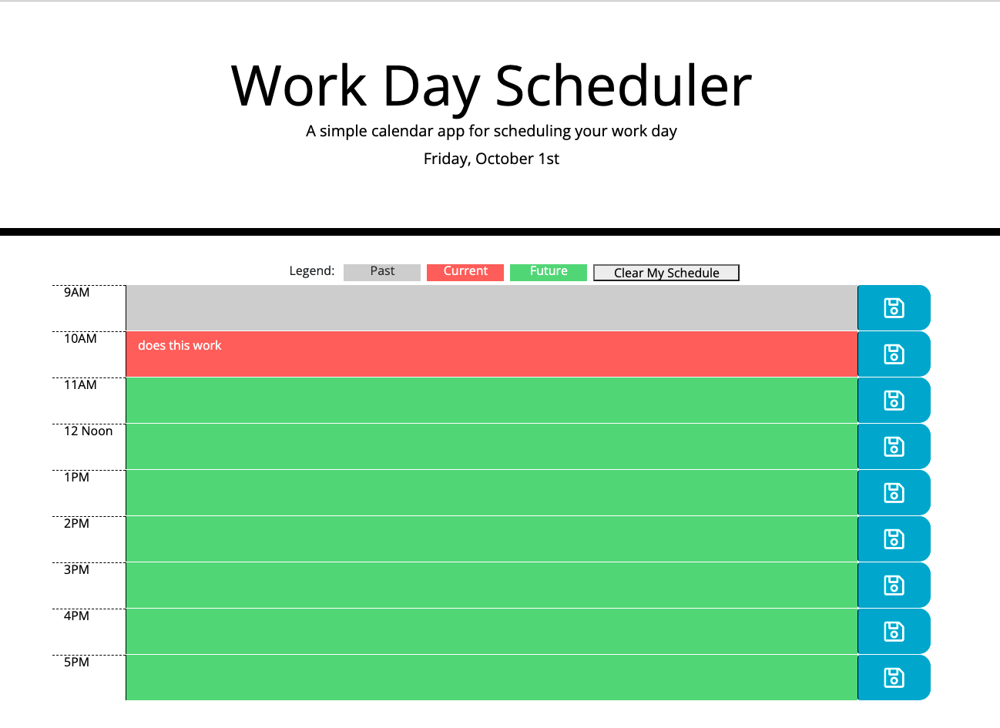

# Work Day Scheduler
Week 5 Challenge: Work Day Scheduler

## Purpose

A simple a daily planner that stores tasks by the hour

## Functionality

* Current day displayed in jumbotron area. 

* User can input tasks into time slots and save.

* Tasks will stay in localStorage when user refreshes. 

* Hour slots are color coded to let user know if their task is due that hour, already passed, or in the future. 

* User can clear their schedule with the click of the Clear My Schedule button.

## Links to Content

* [URL of the GitHub repository](https://github.com/cshepscorp/work-day-scheduler)

* [URL of the deployed application](https://cshepscorp.github.io/work-day-scheduler/)

## Built With

* HTML

* CSS

* Javascript

